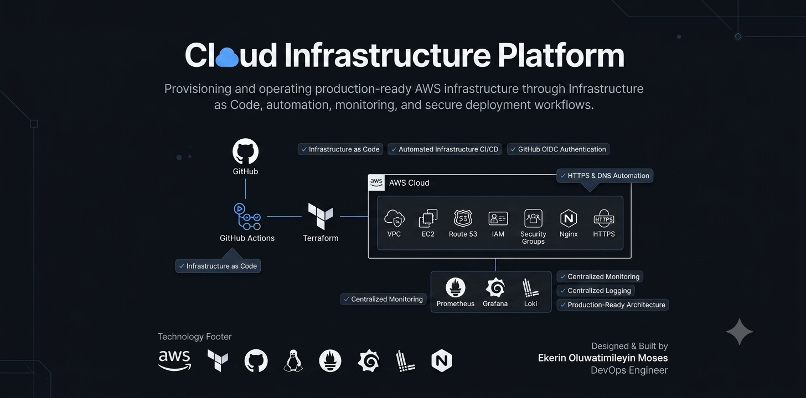

# HNG Infrastructure - Production-Grade AWS Infrastructure

## Overview

A complete, production-ready infrastructure-as-code deployment demonstrating modern DevOps practices. This project goes from code to fully operational system in ~5 minutes with zero manual steps.

**Live:** https://infra.mosesekerin.name.ng/ | **Status:** ✅ Operational

---

## Architecture At a Glance

<p align="center">
  
</p>

For detailed architecture diagrams and flow, see
[DOCUMENTATION/03_ARCHITECTURE.md](DOCUMENTATION/03_ARCHITECTURE.md)

---

## What's Running

- **VPC + Networking** - AWS infrastructure on us-east-1
- **HTTPS** - Let's Encrypt certificate with automatic renewal
- **Application** - Multi-container microservices (Frontend, Backend, Redis, Worker)
- **Monitoring** - Prometheus + Grafana dashboards
- **Logging** - Loki log aggregation
- **CI/CD** - GitHub Actions with OIDC, zero stored credentials
- **Security** - HTTPS, SSH hardening, encryption, IAM roles

---

## Key Statistics

| Metric | Value |
|--------|-------|
| Time to full deployment | 5-10 minutes |
| Manual deployment steps | 0 (fully automated) |
| Technologies integrated | 20+ |
| Security hardening items | 10+ |
| Monitoring targets | Multiple |
| Major issues debugged | 5 (systematically resolved) |

---

## Quick Start

```bash
# 1. View what will be created
cd environments/prod
terraform plan -var-file=example.tfvars

# 2. Deploy infrastructure
terraform apply -var-file=example.tfvars

# 3. Watch GitHub Actions (CI/CD)
# https://github.com/mosesekerin/hng-infrastructure/actions

# 4. Access the system
# https://infra.mosesekerin.name.ng/
```

---

## Project Phases

The infrastructure was built incrementally across 6 phases:

| Phase | Focus | Status |
|-------|-------|--------|
| **1** | Infrastructure foundations (VPC, EC2, Route53, State) | ✅ Complete |
| **3** | HTTPS & Nginx with Let's Encrypt auto-renewal | ✅ Complete |
| **4** | Monitoring stack (Prometheus, Grafana, Node Exporter) | ✅ Complete |
| **5** | Logging stack (Loki, Promtail) | ✅ Complete |
| **6** | CI/CD pipeline (GitHub Actions, OIDC) + Application | ✅ Complete |
| **7** | Reliability engineering (SLOs, runbooks) | 🔄 Planned |

Complete timeline with milestones:
[DOCUMENTATION/02_PROJECT_TIMELINE.md](DOCUMENTATION/02_PROJECT_TIMELINE.md)

---

## Technology Stack

- **Infrastructure:** Terraform, AWS (VPC, EC2, Route53, S3, IAM).
- **Deployment:** GitHub Actions, OIDC authentication.
- **Application:** Docker, Docker Compose.
- **Web:** Nginx, Let's Encrypt, TLS 1.2+.
- **Monitoring:** Prometheus, Grafana, Node Exporter.
- **Logging:** Loki, Promtail.
- **Security:** Encryption at rest/transit, SSH hardening, OIDC, KMS.
- **OS:** Ubuntu 22.04 LTS.

Why each technology was chosen and alternatives considered:
[DOCUMENTATION/04_TECHNOLOGY_STACK.md](DOCUMENTATION/04_TECHNOLOGY_STACK.md)

---

## Engineering Decisions

This project represents **18 major architectural and implementation decisions**,
each with documented reasoning, alternatives considered, and trade-offs.

Examples:
- Why Terraform over CloudFormation
- Why OIDC instead of stored AWS credentials
- Why self-hosted Prometheus instead of AWS CloudWatch
- Why single AZ for this use case
- Why modular architecture

Each decision documented with full reasoning:
[DOCUMENTATION/05_ENGINEERING_DECISIONS.md](DOCUMENTATION/05_ENGINEERING_DECISIONS.md)

---

## Problem-Solving

Built into operations were **5 major complex problems** that were debugged
and solved systematically:

1. **Terraform plan hanging** → Missing variables in CI/CD config
2. **Output parsing failure** → Binary plan file needed conversion to text
3. **GitHub Actions metadata pollution** → Debug output mixed with command output
4. **IAM permission cascade** → Missing IAM:GetRole permission
5. **Variable substitution errors** → templatefile() vs bash syntax conflict

Each problem includes symptoms, root cause analysis, debugging process, and lesson learned:
[DOCUMENTATION/06_PROBLEMS_AND_SOLUTIONS.md](DOCUMENTATION/06_PROBLEMS_AND_SOLUTIONS.md)

---

## Security Posture

Security is built-in, not bolted-on:

- ✅ **Zero stored credentials** - OIDC temporary tokens only.
- ✅ **Encryption everywhere** - At rest (EBS, S3), in transit (HTTPS).
- ✅ **SSH hardening** - Key-based only, CIDR restricted.
- ✅ **Network security** - Security groups, restricted ingress.
- ✅ **Secret management** - AWS Parameter Store with KMS.
- ✅ **Audit trail** - CloudTrail, GitHub Actions logs, git history.

Complete security analysis with threat model and recommendations:
[DOCUMENTATION/09_SECURITY.md](DOCUMENTATION/09_SECURITY.md)

---

## Operations & Monitoring

### How to Operate

Common operations, troubleshooting procedures, maintenance tasks, and
emergency procedures documented:
[DOCUMENTATION/08_OPERATIONAL_GUIDE.md](DOCUMENTATION/08_OPERATIONAL_GUIDE.md)

### Monitoring Dashboard

Access monitoring at:
- **Prometheus:** http://100.25.222.228:9090 (raw metrics)
- **Grafana:** http://100.25.222.228:3000 (dashboards, login: admin/admin)
- **Loki:** http://100.25.222.228:3100 (log API)

### Key Metrics

All infrastructure deployed without manual steps. Real-time metrics available
in Grafana showing:
- CPU, memory, disk utilization
- Request latency and throughput
- Container health status
- Log patterns and errors

Performance characteristics and metrics:
[DOCUMENTATION/10_PERFORMANCE.md](DOCUMENTATION/10_PERFORMANCE.md)

---

## Documentation

Complete engineering documentation covering all aspects:

| Document | Content |
|----------|---------|
| [Executive Summary](DOCUMENTATION/01_EXECUTIVE_SUMMARY.md) | Overview, success metrics, technical achievements |
| [Project Timeline](DOCUMENTATION/02_PROJECT_TIMELINE.md) | Phase-by-phase evolution, milestones, debugging sessions |
| [Architecture](DOCUMENTATION/03_ARCHITECTURE.md) | System design, components, data flows, diagrams |
| [Technology Stack](DOCUMENTATION/04_TECHNOLOGY_STACK.md) | Tech choices, rationale, alternatives |
| [Engineering Decisions](DOCUMENTATION/05_ENGINEERING_DECISIONS.md) | 18 decisions with reasoning and trade-offs |
| [Problems & Solutions](DOCUMENTATION/06_PROBLEMS_AND_SOLUTIONS.md) | Debugging approach, root cause analysis |
| [Features & Capabilities](DOCUMENTATION/07_FEATURES_AND_CAPABILITIES.md) | What the system can do, usage examples |
| [Operational Guide](DOCUMENTATION/08_OPERATIONAL_GUIDE.md) | How to operate, troubleshoot, maintain |
| [Security](DOCUMENTATION/09_SECURITY.md) | Security posture, threat model, hardening |
| [Performance](DOCUMENTATION/10_PERFORMANCE.md) | Metrics, benchmarks, resource utilization |
| [Lessons Learned](DOCUMENTATION/11_LESSONS_LEARNED.md) | Key takeaways from building this |

---

## Features & Capabilities

### What You Can Do With This Infrastructure

**Infrastructure as Code:**
- Declare complete infrastructure in code
- Version control all changes
- Reproduce infrastructure anytime
- Deploy to multiple environments

**Automated Deployments:**
- Deploy via GitHub (no manual commands)
- Plan changes in pull requests
- Require approval before production
- Full audit trail

**HTTPS & Security:**
- Valid SSL certificate from Let's Encrypt
- Automatic renewal (no manual intervention)
- HTTPS-only, with security headers
- TLS 1.2 and 1.3

**Complete Observability:**
- Metrics collection (Prometheus)
- Dashboards (Grafana)
- Centralized logging (Loki)
- Health checks and alerts

**Application Deployment:**
- Multi-container microservices
- Automatic health checks
- Service discovery
- Secrets injection

Full feature list and usage examples:
[DOCUMENTATION/07_FEATURES_AND_CAPABILITIES.md](DOCUMENTATION/07_FEATURES_AND_CAPABILITIES.md)

---

## What Makes This Production-Ready

- ✅ Infrastructure reproducible (destroy and rebuild anytime)
- ✅ Zero manual deployment steps (fully automated)
- ✅ Complete observability (metrics, logs, alerts)
- ✅ Security hardened (encryption, OIDC, least privilege)
- ✅ Disaster recovery (full backup and recovery)
- ✅ Thoroughly documented (11 comprehensive documents)
- ✅ Real-world patterns (not toy project examples)

---

## Getting Help

### Common Tasks

See [DOCUMENTATION/08_OPERATIONAL_GUIDE.md](DOCUMENTATION/08_OPERATIONAL_GUIDE.md) for:
- How to SSH to the instance
- How to check service status
- How to scale resources
- How to troubleshoot issues
- Deployment procedures
- Rollback procedures

### Understanding Design

See [DOCUMENTATION/03_ARCHITECTURE.md](DOCUMENTATION/03_ARCHITECTURE.md) for:
- Complete system architecture
- Component interactions
- Data flows
- Security boundaries
- Scaling considerations

### For Specific Questions

- **"Why was this technology chosen?"** → [Technology Stack](DOCUMENTATION/04_TECHNOLOGY_STACK.md)
- **"How was this decision made?"** → [Engineering Decisions](DOCUMENTATION/05_ENGINEERING_DECISIONS.md)
- **"How do I debug X?"** → [Problems & Solutions](DOCUMENTATION/06_PROBLEMS_AND_SOLUTIONS.md)
- **"Is this secure?"** → [Security Analysis](DOCUMENTATION/09_SECURITY.md)
- **"What can this system do?"** → [Features & Capabilities](DOCUMENTATION/07_FEATURES_AND_CAPABILITIES.md)

---

## Key Insights

From building this infrastructure:

1. **Infrastructure as Code changes everything** - From hours to minutes to redeploy
2. **Testing infrastructure first matters** - terraform plan catches issues before apply
3. **Monitoring from the start** - Not an afterthought
4. **Security by default** - OIDC, encryption, hardening built-in
5. **Systematic debugging** - Root cause beats random fixes
6. **Documentation preserves knowledge** - Decisions explained for future reference

Complete lessons learned:
[DOCUMENTATION/11_LESSONS_LEARNED.md](DOCUMENTATION/11_LESSONS_LEARNED.md)

---

## Deployment Status

- ✅ Infrastructure: Running (AWS us-east-1)
- ✅ HTTPS: Active with valid certificate
- ✅ Monitoring: Operational (Prometheus + Grafana)
- ✅ Logging: Aggregated (Loki + Promtail)
- ✅ CI/CD: Fully automated (GitHub Actions)
- ✅ Application: Deployed (Docker Compose)
- ✅ Uptime: 24/7 (as long as AWS availability)

---

## License

This project is shared as educational material and portfolio evidence.

---

## Questions or Feedback?

- **GitHub Issues:** Report problems or suggest improvements
- **Pull Requests:** Contributions welcome
- **Email:** mosesekerin@gmail.com

---

*Last updated: July 14, 2026 | Status: Production Ready*
